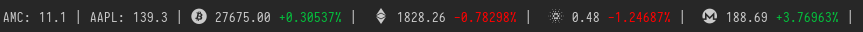
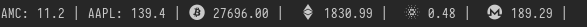
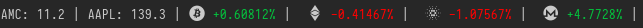

# polybar-cryptostocks
A *polybar script* that displays the price of various **crypto-currencies** and **stocks**.




# Setup

Assuming your polybar config and scripts are in ~/.config/polybar/

```
git clone https://github.com/danama/polybar-cryptostocks.git &&
    cd polybar-cryptostocks &&
    mkdir -p ~/.config/polybar &&
    cp ./{cryptostocks-config,cryptostocks.py} ~/.config/polybar &&
    sudo chmod u+x ~/.config/polybar/cryptostocks.py
```

Then in `~/.config/polybar/config`:

```
[bar/top]

...

modules-right = crypto

...

[module/crypto]
type = custom/script
interval = 300
exec = /home/<user>/.config/polybar/cryptostocks.py

```

## Dependencies
The more up to date [cryptofont](https://github.com/monzanifabio/cryptofont) *icon font* is used in the screenshots, though you are free to use any other font.

If using the **cryptofont** icon font, ensure that the following line is present in your `~/.config/polybar/config`:

```
[bar/top]

...

font-0 = cryptofont:style=Regular;0
```

# Example Configuration

`~/.config/polybar/cryptostocks-config.yml`

Features/options:
- Select your currency for conversions (crypto only)
- Define decimals for stocks prices (stocks only)
- Enable or Disable colors in polybar (default = True)
- Define up and down trends color
- Same structure for both types with placeholders for future improvements/fixes.
- Select the display mode per crypto

```
general:
  crypto_base_currency: USD
  stock_roundnumber: 1
  colors: True
  up_color: "%{F#03c03c}"
  down_color: "%{F#f00}"

stocks:
  AMC:
    name: 'AMC Entertainment Holdings Inc'
    ticker: 'AMC'
    label: 'AMC'
  AAPL:
    name: 'Apple Inc'
    ticker: 'AAPL'
    label: 'AAPL'

cryptos:
  bitcoin:
    name: 'bitcoin'
    ticker: 'BTC'
    icon: ''
    display: 'both'
  ethereum:
    name: 'ethereum'
    ticker: 'ETH'
    icon: ''
    display: 'both'
  cardano:
    name: 'cardano'
    ticker: 'ADA'
    icon: ''
    display: 'both'
  monero:
    name: 'monero'
    ticker: 'XMR'
    icon: ''
    display: 'both'
```

# Tips

## Multiple Fonts
If you need more than 1 font and/or to avoid conflicting ones you can define them in the relevant bar and select the right one for the module ( font-0 = 1, font-1 = 2, ...).

```

[bar/top]

...

font-0 = "Iosevka Nerd Font:size=10;4"
font-1 = "feather:size=10;3"
font-2 = "cryptofont:style=Regular;3"
...

```

```
[module/crypto]

...

label-font = 3
```

## Work with fonts in the config file
You can use a tool like "Font Manager" to easily copy/paste the desired icon to an editor who supports the font. In my case, vscodium works just fine to preview (once you add it in the settings) 


# Display Modes

`display = price`



`display = percentage`



`display = both`


# To work on

- add 24h prices variations for stocks
- ~~add function for crypto requests~~
- separators ( | ) as optional
- look into interactions with the module
- ...


# Credits 

- https://github.com/willHol/polybar-crypto
- https://github.com/zack-ashen/polystock
- https://github.com/monzanifabio/cryptofont